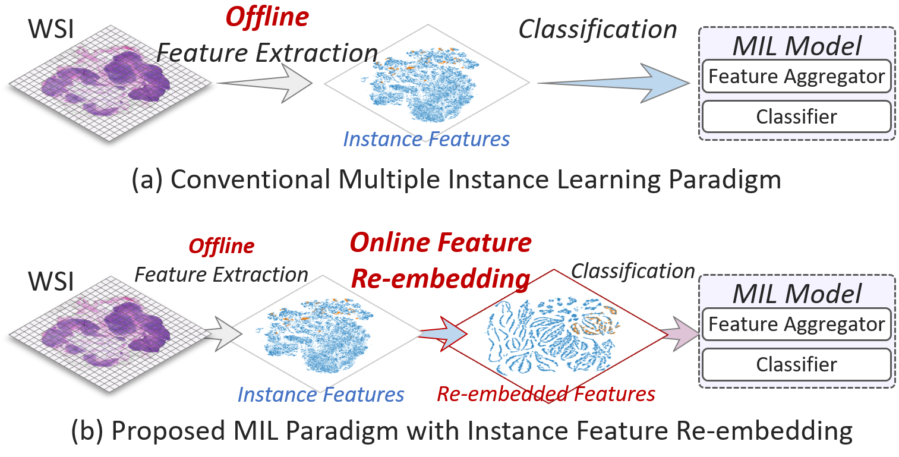

# R$`^2`$T-MIL (Updating)
Official repo of **Feature Re-Embedding: Towards Foundation Model-Level Performance in Computational Pathology**, CVPR 2024. [[arXiv]](https://arxiv.org/abs/2402.17228)

<p align = "center">

</p>

## TODO
- Merge training scripts for the full task
- Improving README document
- Uploading DOCKERFILE
- ~~Uploading codes about survival prediction~~

## News
- Uploaded interim Survival code, and training scripts for the full task will be fused later.
- Uploaded almost all codes, [docker](https://pan.baidu.com/s/1EN1JUbIjAl73NwHZF3YlPA?pwd=fek8), and [datasets](https://pan.baidu.com/s/1mSzLJ_RVCJFQGe2lZAvEUA?pwd=2024).

## Prepare Patch Features
To preprocess WSIs, we used [CLAM](https://github.com/mahmoodlab/CLAM/tree/master#wsi-segmentation-and-patching). PLIP model and weight can be found in [this](https://github.com/PathologyFoundation/plip).

Download the preprocessed patch features: [Baidu Cloud](https://pan.baidu.com/s/1mSzLJ_RVCJFQGe2lZAvEUA?pwd=2024).

### Patching
`--preset` [bwh_biopsy.csv](https://github.com/mahmoodlab/CLAM/blob/master/presets/bwh_biopsy.csv) for Camlyon (*It's the preset parameters officially provided by CLAM*), `--preset` [preprocess_tcga_nsclc.csv](https://github.com/DearCaat/MHIM-MIL/blob/master/dataset_csv/preprocess_tcga_nsclc.csv) for TCGA-NSCLS (*It's the customized parameters*), `--preset` [tcga.csv](https://github.com/mahmoodlab/CLAM/blob/master/presets/tcga.csv) for other TCGA-BRCA (*It's the preset parameters officially provided by CLAM*)
```shell
# for Camlyon
python create_patches_fp.py --source DATA_DIRECTORY --save_dir RESULTS_DIRECTORY --patch_size 512 \
--step_size 512 --preset bwh_biopsy.csv --seg --patch
# for TCGA-NSCLC
python create_patches_fp.py --source DATA_DIRECTORY --save_dir RESULTS_DIRECTORY --patch_size 512 \
--step_size 512 --preset preprocess_tcga_nsclc.csv --seg --patch
```

### Feature Extraction
Some code snippets about PLIP feature are shown below:

`extract_features_fp.py`:
```
model = PLIP()
n_parameters = sum(p.numel() for p in model.parameters() if p.requires_grad)
mean, std = (0.48145466, 0.4578275, 0.40821073), (0.26862954, 0.26130258, 0.27577711)
eval_transforms = transforms.Compose([transforms.ToTensor(), transforms.Normalize(mean = mean, std = std)])
```

`models/plip.py`
```
from transformers import CLIPVisionModelWithProjection

class PLIP(torch.nn.Module):
    def __init__(self):
        super(PLIPM,self).__init__()
        self.model = model = CLIPVisionModelWithProjection.from_pretrained("vinid/plip")
    def forward(self, input):
        return self.model(batch_input).image_embeds
```

## Plug R$`^2`$T into Your Model
`epeg_k`，`crmsa_k` are the primary hyper-paras, you can set `crmsa_mlp`, `all_shortcut` if you want.

`region_num` is the important hyper-para for GPU memory, and increasing it can significantly reduce GPU memory usage. Its default value is `8`, which takes up about `10GB` with an average sequence length of `9000`. I recommend changing this value to `16` or even `larger` if you want to apply it to **longer sequence** tasks such as **survival prediction**.
```shell
from rrt import RRTEncoder 

# you should put the rrt_enc before aggregation module, after fc and dp
# x_rrt = fc(x_rrt) # 1,N,1024 -> 1,N,512
# x_rrt = dropout(x_rrt)
rrt = RRTEncoder(mlp_dim=512,epeg_k=15,crmsa_k=3) 
x_rrt = rrt(x_rrt) # 1,N,512 -> 1,N,512
# x_rrt = mil_model(x_rrt) # 1,N,512 -> 1,N,C
```

## Train R$`^2`$T-MIL
Download the Docker Image: [Baidu Cloud](https://pan.baidu.com/s/1EN1JUbIjAl73NwHZF3YlPA?pwd=fek8).

Note: *Because of code refactoring, this repository cannot fully reproduce the results in the paper. If you have a need for this, please contact [me](mailto:whtang@cqu.edu.cn) via email.*
### Cancer Diagnose
#### C16-R50
```shell
python3 main.py --project=$PROJECT_NAME --datasets=camelyon16 \
--dataset_root=$DATASET_PATH --model_path=$OUTPUT_PATH --cv_fold=5 \
--model=rrtmil --pool=attn --n_trans_layers=2 --da_act=tanh --title=c16_r50_rrtmil \
--epeg_k=15 --crmsa_k=1 --all_shortcut --seed=2021
```
#### C16-PLIP
```shell
python3 main.py --project=$PROJECT_NAME --datasets=camelyon16 \
--dataset_root=$DATASET_PATH --model_path=$OUTPUT_PATH --cv_fold=5 \
--model=rrtmil --pool=attn --n_trans_layers=2 --da_act=tanh --title=c16_plip_rrtmil \
--epeg_k=9 --crmsa_k=3 --all_shortcut --input_dim=512 --seed=2021
```
### Cancer Sub-typing
#### TCGA-BRCA-R50
```shell
python3 main.py --project=$PROJECT_NAME --datasets=tcga --tcga_sub=brca \
--dataset_root=$DATASET_PATH --model_path=$OUTPUT_PATH --cv_fold=5 \
--model=rrtmil --pool=attn --n_trans_layers=2 --da_act=tanh --title=brca_r50_rrtmil \
--epeg_k=17 --crmsa_k=3 --crmsa_heads=1 --input_dim=512 --seed=2021
```
#### TCGA-BRCA-PLIP
```shell
python3 main.py --project=$PROJECT_NAME --datasets=tcga --tcga_sub=brca \
--dataset_root=$DATASET_PATH --model_path=$OUTPUT_PATH --cv_fold=5 \
--model=rrtmil --pool=attn --n_trans_layers=2 --da_act=tanh --title=brca_plip_rrtmil \
--all_shortcut --crmsa_k=1 --input_dim=512 --seed=2021
```
#### TCGA-NSCLC-R50
```shell
python3 main.py --project=$PROJECT_NAME --datasets=tcga \
--dataset_root=$DATASET_PATH --model_path=$OUTPUT_PATH --cv_fold=5 \
--model=rrtmil --pool=attn --n_trans_layers=2 --da_act=tanh --title=nsclc_r50_rrtmil \
--epeg_k=21 --crmsa_k=5 --input_dim=512 --seed=2021
```
#### TCGA-NSCLC-PLIP
```shell
python3 main.py --project=$PROJECT_NAME --datasets=tcga \
--dataset_root=$DATASET_PATH --model_path=$OUTPUT_PATH --cv_fold=5 \
--model=rrtmil --pool=attn --n_trans_layers=2 --da_act=tanh --title=nsclc_plip_rrtmil \
--all_shortcut --crmsa_mlp --epeg_k=13 --crmsa_k=3 --crmsa_heads=1 \
--input_dim=512 --seed=2021
```

### Survival Prediction
`study` = `{BLCA LUAD LUSC}`, `feat` = `{resnet50 plip}`. It is better to perform a grid search for the hyperparameters `crmsa_k={1,3,5}` and `epeg_k={9,15,21}`.
```shell
python ./Surviva/main.py --model RRTMIL \
                         --excel_file ./csv/${study}_Splits.csv \
                         --num_epoch 30 \
                         --epeg_k 15 crmsa_k 3\
                         --folder $feat

```

## Train R$`^2`$T + more MILs
set `--only_rrt_enc` and change the `--model` with model name，e.g., for `clam_sb`:
```shell
python3 main.py --project=$PROJECT_NAME --datasets=tcga --tcga_sub=brca \
--dataset_root=$DATASET_PATH --model_path=$OUTPUT_PATH --cv_fold=5 \
--model=clam_sb --only_rrt_enc --n_trans_layers=2 --title=brca_plip_rrt_clam \ 
--all_shortcut --crmsa_k=1 --input_dim=512 --seed=2021
```

## Citing R$`^2`$T-MIL
```
@InProceedings{tang2024feature,
    author    = {Tang, Wenhao and Zhou, Fengtao and Huang, Sheng and Zhu, Xiang and Zhang, Yi and Liu, Bo},
    title     = {Feature Re-Embedding: Towards Foundation Model-Level Performance in Computational Pathology},
    booktitle = {Proceedings of the IEEE/CVF Conference on Computer Vision and Pattern Recognition (CVPR)},
    month     = {June},
    year      = {2024},
    pages     = {11343-11352}
}
```
